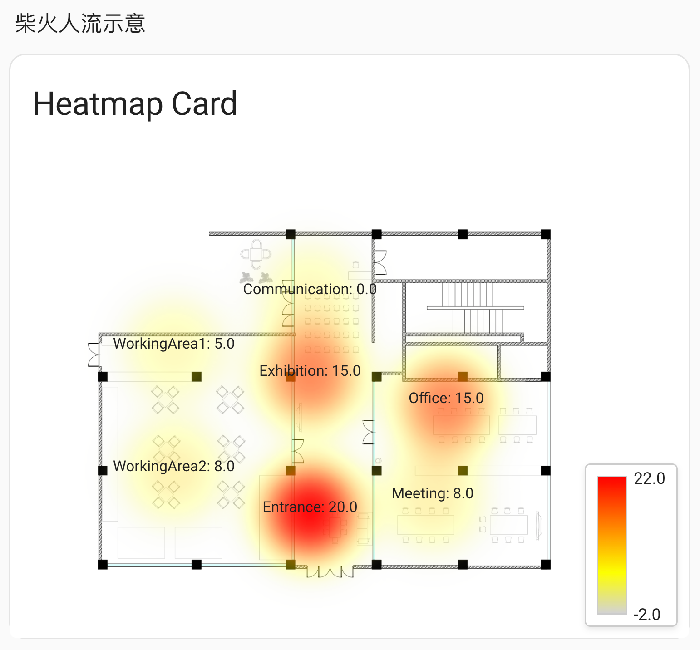

# 🔥 Home Assistant Heatmap Card

A custom Lovelace card for Home Assistant that displays beautiful heatmaps overlaid on background images. Perfect for visualizing temperature distributions, sensor data, or any numeric values across floor plans or other images.

[![GitHub Release][releases-shield]][releases]
[![License][license-shield]](LICENSE)
[![hacs][hacsbadge]][hacs]



## ✨ Features

- 📷 Support for PNG, JPG, and SVG background images
- 🔥 Real-time heatmap rendering using simpleheat
- 🧩 Dynamic binding to Home Assistant entity values
- 🔁 Configurable auto-update intervals
- 🎨 Customizable color gradients
- 📈 Auto-scaling with adjustable margins
- 💬 Interactive tooltips showing values on hover
- 📊 Optional legend with customizable position
- 📱 Responsive design for all devices
- 🛡️ Comprehensive error handling

## 📦 Installation

### HACS (Recommended)

Since this card is not yet in the HACS default repository, you'll need to add it as a custom repository:

1. Open HACS in your Home Assistant instance.
2. Go to "Frontend".
3. Click the three dots in the top right corner and select "Custom repositories".
4. In the dialog, paste the URL to this GitHub repository: `https://github.com/Seeed-Solution/lovelace-heatmap-card`
5. Select "Dashboard" as the category.
6. Click "ADD".
7. The card should now appear in the HACS Frontend section. Click on it.
8. Click "INSTALL THIS REPOSITORY IN HACS".
9. Click "INSTALL".
10. Restart Home Assistant if prompted or if the card doesn't load immediately.

### Manual Installation

1. Download `heatmap-card.js` from the [latest release][releases].
2. Copy the downloaded `heatmap-card.js` file into your Home Assistant `config/www/` directory. (If the `www` directory doesn't exist, create it.)
3. Add the card as a resource in your Lovelace configuration. This tells Home Assistant where to find the card's code.
   To do this via the UI (recommended for most users):
    a. Go to Settings > Dashboards.
    b. Select the dashboard you want to add the card to (or create a new one).
    c. Click the three dots (⋮) in the top right and choose "Edit dashboard".
    d. Click the three dots (⋮) again and choose "Manage resources".
    e. Click the "+ ADD RESOURCE" button (usually in the bottom right).
    f. Enter the following:
        - URL: `/local/heatmap-card.js`
        - Resource type: `JavaScript Module`
    g. Click "CREATE".

   Alternatively, if you manage your Lovelace configuration in YAML mode, add the following to the `resources` section of your `ui-lovelace.yaml` or dashboard YAML file:

   ```yaml
   resources:
     - url: /local/heatmap-card.js
       type: module
   ```
4. Refresh Home Assistant: You might need to refresh your browser or restart Home Assistant for the new resource to be loaded correctly.

## 🚀 Quick Start

Add this to your Lovelace dashboard:

```yaml
type: custom:heatmap-card
background: /local/floorplan.png
points:
  - x: 120
    y: 100
    entity_id: sensor.living_room_temperature
    label: "Living Room"
  - x: 320
    y: 180
    entity_id: sensor.kitchen_temperature
    label: "Kitchen"
  - x: 200
    y: 300
    entity_id: sensor.bedroom_temperature
    label: "Bedroom"
```

## ⚙️ Configuration

### Basic Options

| Name | Type | Default | Description |
|------|------|---------|-------------|
| `background` | string | **Required** | Path to background image |
| `points` | array | **Required** | Array of heatmap points |
| `width` | number | auto | Card width in pixels |
| `height` | number | auto | Card height in pixels |

### Heatmap Options

| Name | Type | Default | Description |
|------|------|---------|-------------|
| `radius` | number | 40 | Heat point radius (min: 1) |
| `blur` | number | 15 | Additional blur radius in pixels (min: 0) |
| `opacity` | number | 0.6 | Heatmap opacity (0-1) |
| `gradient` | object | Blue→Green→Red | Color gradient configuration |

### Scaling Options

| Name | Type | Default | Description |
|------|------|---------|-------------|
| `auto_scale` | boolean | false | Enable automatic value scaling |
| `scale_margin` | number | 0 | Margin percentage for auto-scaling (0-50) |
| `min_value` | number | 0 | Manual minimum value |
| `max_value` | number | 100 | Manual maximum value |

### Display Options

| Name | Type | Default | Description |
|------|------|---------|-------------|
| `show_legend` | boolean | false | Show color scale legend |
| `legend_unit` | string | "" | Unit text for legend |
| `show_labels` | boolean | false | Show value labels on points |
| `update_interval` | number | 30 | Update interval in seconds (5-3600) |

### Point Configuration

Each point in the `points` array supports:

| Name | Type | Required | Description |
|------|------|----------|-------------|
| `x` | number | ✅ | X coordinate on image |
| `y` | number | ✅ | Y coordinate on image |
| `entity_id` | string | ❌ | Home Assistant entity ID |
| `value` | number | ❌ | Static value (if no entity_id) |
| `label` | string | ❌ | Display label |
| `weight` | number | ❌ | Point weight multiplier (0.1-2.0) |

**Note:** Each point must have either `entity_id` or `value`, but not both.

## 📊 Examples


### Office People Flow Example

This example demonstrates a more complex layout for an office, showing potential people flow or occupancy.


```yaml
type: custom:heatmap-card
background: /local/images/firewood_fp.jpg # User needs to place firewood_fp.jpg in config/www/images/
points:
  - x: 220
    y: 100
    entity_id: sensor.your_temperature_sensor # Replace with your actual sensor
    label: Communication
  - x: 300
    y: 250
    value: 8
    label: Meeting
    weight: 0.8
  - x: 300
    y: 180
    value: 15
    label: Office
    weight: 0.8
  - x: 120
    y: 140
    value: 5
    label: WorkingArea1
    weight: 0.8
  - x: 120
    y: 230
    value: 8
    label: WorkingArea2
    weight: 0.8
  - x: 220
    y: 160
    value: 15
    label: Exhibition
    weight: 0.8
  - x: 220
    y: 260
    value: 20
    label: Entrance
    weight: 0.8
radius: 40
blur: 30
opacity: 0.7
auto_scale: true
scale_margin: 10
update_interval: 30 # In seconds
show_legend: true
legend_unit: ""
show_labels: true
error_message: Error loading heatmap data.
gradient:
  "0.0": "#d3d3d3" # Corrected from "0"
  "0.3": "#ffff00"
  "1.0": "#ff0000" # Corrected from "1"
```

## 🎨 Custom Color Gradients

Create custom gradients by specifying color stops at positions from 0 to 1:

```yaml
gradient:
  0.0: "#ffffff"   # White at minimum
  0.2: "#ffcccc"   # Light red
  0.4: "#ff9999"   # 
  0.6: "#ff6666"   # 
  0.8: "#ff3333"   # 
  1.0: "#ff0000"   # Red at maximum
```

### Predefined Gradient Examples

**Cool to Warm:**
```yaml
gradient:
  0.0: "#001f3f"  # Navy
  0.25: "#0074D9" # Blue
  0.5: "#39CCCC"  # Teal
  0.75: "#FFDC00" # Yellow
  1.0: "#FF4136"  # Red
```

**Monochrome:**
```yaml
gradient:
  0.0: "#ffffff"  # White
  0.5: "#888888"  # Gray
  1.0: "#000000"  # Black
```

## 🔍 Finding Coordinates

To find the correct x,y coordinates for your points:

1. Open your background image in an image editor
2. Note the pixel coordinates where you want to place heat points
3. If using `width`/`height` settings, scale coordinates proportionally
4. Use browser developer tools to fine-tune positions

## 🐛 Troubleshooting

### Image not loading
- Check the image path is correct
- Ensure the image is in `/config/www/heatmap-card/` for local images
- Use `/local/heatmap-card/` prefix for local images

### Entity values not updating
- Verify entity IDs are correct
- Check entities exist in Developer Tools > States
- Ensure entity values are numeric

### Heatmap not showing
- Check browser console for errors
- Verify at least one point has a valid value
- Try increasing radius or opacity

## 🛠️ Development Setup

If you want to contribute to the development of this card or make your own customizations, follow these steps:

1.  **Clone the Repository:**
    ```bash
    git clone https://github.com/Seeed-Solution/lovelace-heatmap-card.git
    cd lovelace-heatmap-card
    ```

2.  **Install Dependencies:**
    This project uses [Node.js](https://nodejs.org/) and [npm](https://www.npmjs.com/). Make sure you have them installed. Then, install the project dependencies:
    ```bash
    npm install
    ```

3.  **Build the Card:**
    To build the `heatmap-card.js` file from the source code, run:
    ```bash
    npm run build
    ```
    This will compile the TypeScript code and bundle it into the `dist/` directory.

4.  **Development Workflow (Watch for changes):**
    To automatically rebuild the card whenever you make changes to the source files in `src/`, use:
    ```bash
    npm run dev
    ```
    This is useful during development as it keeps the `dist/heatmap-card.js` file up-to-date. You can then copy this file to your Home Assistant `www` directory to test your changes.

## 🤝 Contributing

Contributions are welcome! Please:

1. Fork the repository
2. Create a feature branch
3. Commit your changes
4. Push to the branch
5. Open a Pull Request

## 📄 License

This project is licensed under the MIT License - see the [LICENSE](LICENSE) file for details.

## 🙏 Acknowledgments

- [simpleheat](https://github.com/mourner/simpleheat) for the lightweight and efficient heatmap library
- Home Assistant community for inspiration and feedback
- All contributors and users of this card

---

[releases-shield]: https://img.shields.io/github/release/Seeed-Solution/lovelace-heatmap-card.svg?style=for-the-badge
[releases]: https://github.com/Seeed-Solution/lovelace-heatmap-card/releases
[license-shield]: https://img.shields.io/github/license/Seeed-Solution/lovelace-heatmap-card.svg?style=for-the-badge
[hacs]: https://github.com/hacs/integration
[hacsbadge]: https://img.shields.io/badge/HACS-Custom-orange.svg?style=for-the-badge 